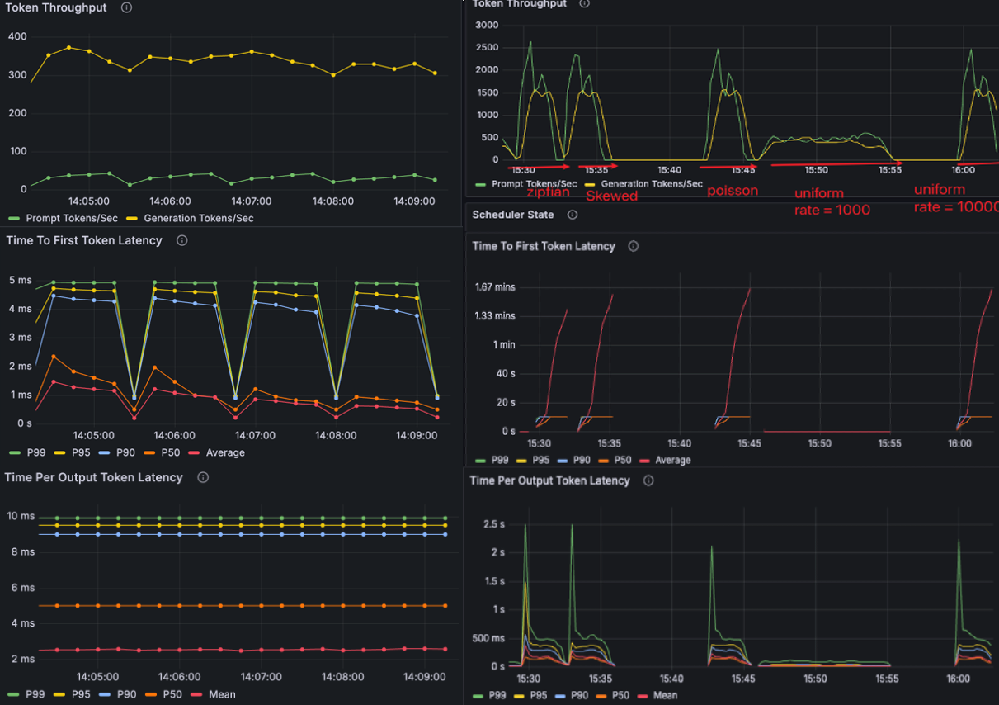
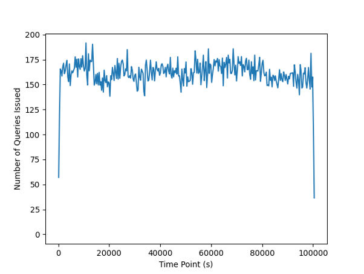
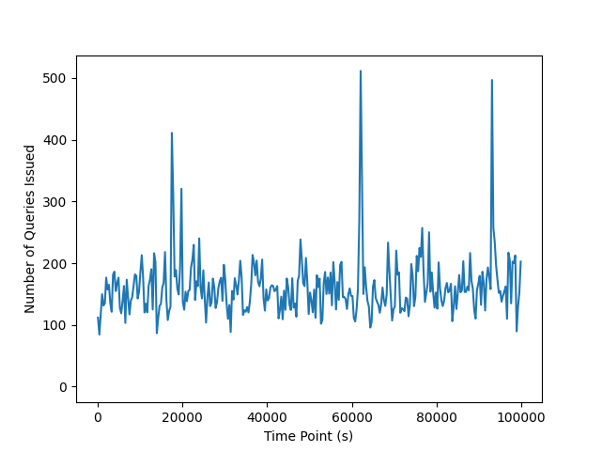
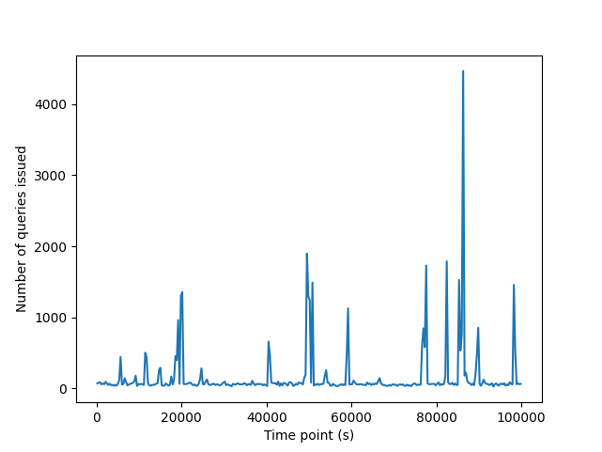

## Flexible Batch of Immediate and Deferred Requests

RA work @ S-Lab at NTU

## Motivation

BatchAPI: OpenAI's Batch API allows you to send asynchronous groups of requests at a 50% lower cost, with access to a dedicated pool offering significantly higher rate limits and guaranteed response times within 24 hours. https://platform.openai.com/docs/guides/batch

Nowadays, there are many different demands of requests. Immediate requests, also real-time, are popular in chatbox, conversation, text generation, code generation. Deferred requests (e.g. BatchAPI requests) process multiple requests at once, typically in a delayed or asynchronous manner, making them ideal for use cases that can tolerate slower response times or need high-throughput processing, which are popular in: text-to-image, image-to-text, video-to-text, and so on. 

For multi-tenat LM inference, it lacks efficient methods to balance the immediate requests and deferred requests. So we want to redesign a request batch strategy, a new CUDA kernel, and scheduling policies to accelerate inference mix requests under different LLM and VLM. 


## Experiments

The follwing metrics are under different distribution of request rate seperately. Uniform Distribution influences the most of system performance. But if we increase the request rate highly, the influence doesn't matter as before. 



Generate different distribution requests referring to the paper Vexless: A Serverless Vector Data Management System Using Cloud Functions
 (https://dl.acm.org/doi/10.1145/3654990). 
 
 Different Distributions requests: outer and inner distribution
 Mix: Uniform, Inverse_gaussian, Poisson, Gaussian, and Zipfian Distributions. 
 

Low Bursty 



Medium Bursty 



High Bursty 



## Installation

### Build from source

```bash
cd FlexiBatch
git submodule sync
git submodule update --init
```
